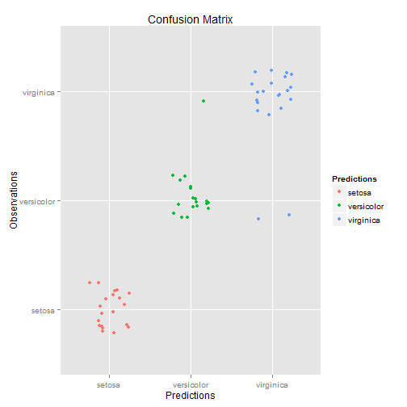

Iris Dataset Prediction Application
========================================================
author: cssampaio
date: October 25 2015
transition: rotate

#### John Hopkins University
#### Coursera Data Science Specialization
#### Developing Data Product Project


Introduction
========================================================

The Iris Dataset Prediction Application uses the Iris Dataset to predict the Species outcome based on the other variables.

Iris Dataset structure:

```
'data.frame':	150 obs. of  5 variables:
 $ Sepal.Length: num  5.1 4.9 4.7 4.6 5 5.4 4.6 5 4.4 4.9 ...
 $ Sepal.Width : num  3.5 3 3.2 3.1 3.6 3.9 3.4 3.4 2.9 3.1 ...
 $ Petal.Length: num  1.4 1.4 1.3 1.5 1.4 1.7 1.4 1.5 1.4 1.5 ...
 $ Petal.Width : num  0.2 0.2 0.2 0.2 0.2 0.4 0.3 0.2 0.2 0.1 ...
 $ Species     : Factor w/ 3 levels "setosa","versicolor",..: 1 1 1 1 1 1 1 1 1 1 ...
```

Application input parameters and results
========================================================

The user have the option to set the input parameters below:
- Seed: integer from 1 to 10
- Machine Learning ML method: 
  - Decision Tree 
  - Random Forest 
  - Boosting from caret package
- Training set partition: from 0.1 to 0.9

***

Once the input is set, the user can check the results:
- Accuracy: measurement of correct predictions.
- Confusion matrix plot: performance of the ML algorithm.

The application is built with reactive operations, so that the calculations are imediately performed and the results updated to the user.

Example
========================================================

### Input 
- Seed = 5
- ML method = Decision Tree
- Training set partition = 0.6

### Results
#### Accuracy

```
Accuracy 
    0.95 
```

***

#### Plot
 

Conclusion
======

The Iris Dataset Prediction Application allows the user to check the influence of the type of Machine Learning Algorithm and the size of training partition in the prediction of the outcome.

Link:
[Iris Dataset Prediction Application](https://cssampaio.shinyapps.io/Project) 
